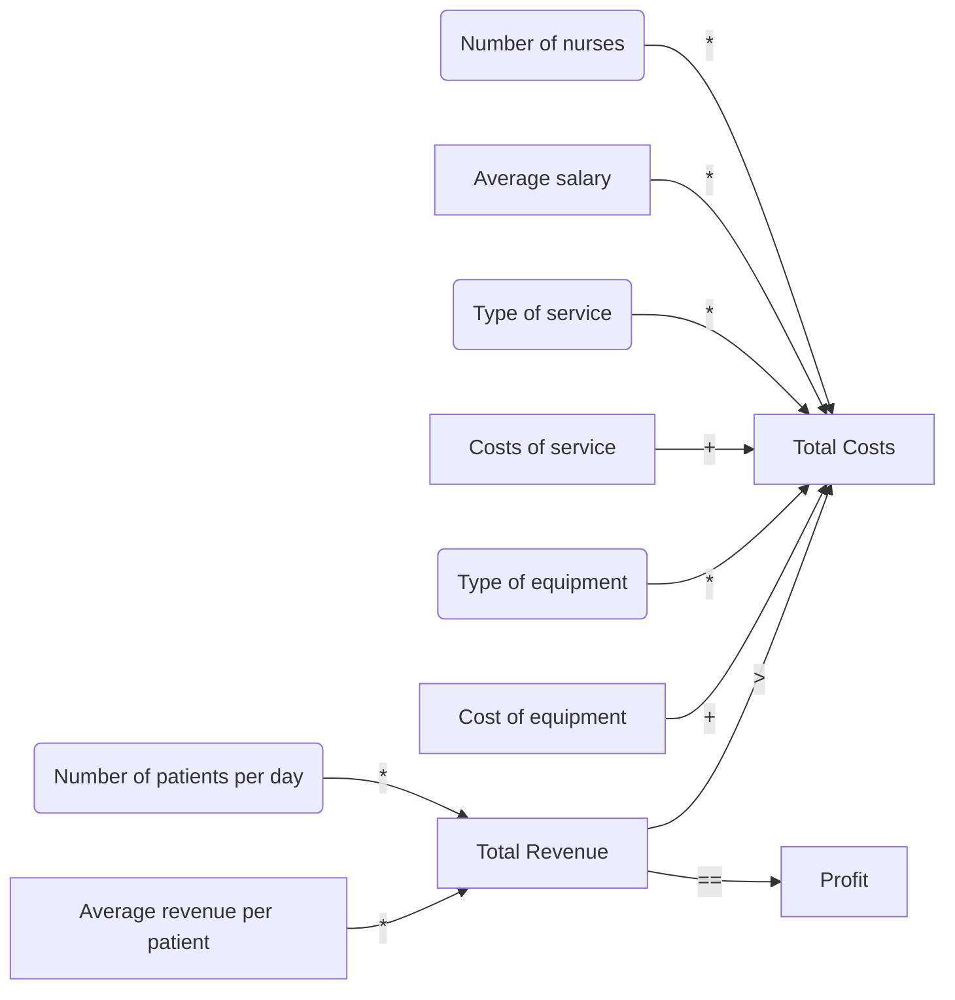

```mermaid
flowchart LR
    TotalRevenue[Total Revenue]
    PatientsPerDay(Number of patients per day)
    AverageRevenuePerPatient[Average revenue per patient]

    PatientsPerDay -->|*| TotalRevenue
    AverageRevenuePerPatient -->|*| TotalRevenue

    TotalCosts[Total Costs]
    Nurses(Number of nurses)
    AverageSalary[Average salary]

    Nurses -->|*| TotalCosts
    AverageSalary -->|*| TotalCosts

    Service(Type of service)
    ServiceCosts[Costs of service]

    Service -->|*| TotalCosts
    ServiceCosts -->|+| TotalCosts

    Equipment(Type of equipment)
    EquipmentCosts[Cost of equipment]

    Equipment -->|*| TotalCosts
    EquipmentCosts -->|+| TotalCosts

    TotalRevenue -->|>| TotalCosts
    TotalRevenue -->|==| Profit
```